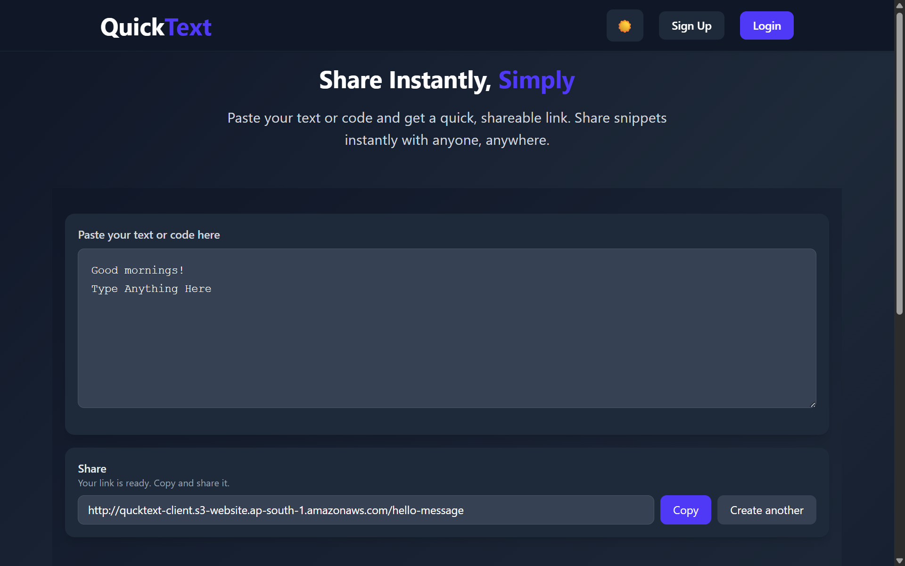
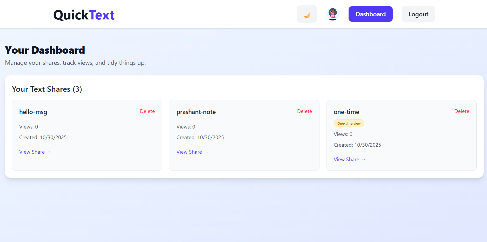

#  QuickText

QuickText is a simple yet powerful tool that lets you instantly create shareable links for any text. Whether you're sharing code snippets, notes, or temporary messages, QuickText makes it effortless.

##  What is QuickText?

QuickText allows you to:
- 📝 Write or paste any text content
-  Generate secure links with custom expiration times
-  Share instantly without mandatory registration
-  Manage your links if you choose to create an account
-  
## 🖼️ Preview

<p align="center">
  
  &nbsp;&nbsp;&nbsp;
  
</p>


##  Live Demo
- **Web App:** https://quicktext-ten.vercel.app/
- **API Server:** Hosted on AWS EC2

## 🛠 Technology Stack

| Layer | Technology |
|-------|-----------|
| Frontend | React (Vite) + Tailwind CSS |
| Backend | Spring Boot (JWT Authentication) |
| Database | MongoDB |
| Hosting | AWS EC2 (Backend) + Vercel(Frontend) |

## 💡 Key Features

 **Anonymous sharing** – No login required  
 **Custom expiration** – Set how long your links stay active  
 **Link management** – View and delete your created links  
 **Responsive design** – Works perfectly on all devices  
 **Fast & lightweight** – Minimal interface, blazing fast

## Local Development Setup

### 🖥 Backend Setup

```bash
# Clone the repository
https://github.com/iamprashantverma/QuickText.git
cd quicktext-server

# Run the Spring Boot application
mvn spring-boot:run
```

**Environment Configuration** (`.env` or system variables):

```properties
DB_PASSWORD=your_mongodb_password
SECRET_KEY=your_jwt_secret_key
API_KEY=your_cloudinary_api_key
API_SECRET=your_cloudinary_api_secret
FRONTEND_URL=http://localhost:5173
```

### 💻 Frontend Setup

```bash
# Navigate to frontend directory
cd quicktext-client

# Install dependencies
npm install

# Set up environment variables
echo "VITE_API_BASE_URL=http://localhost:8080" > .env
VITE_APP_NAME=Quick


# Start development server
npm run dev
```

Your frontend will be running at:  **http://localhost:5173**

## 🐳 Docker Deployment

Run the entire application with a single command:

```bash
sudo docker run -d \
  --name quicktext-app \
  -p 8080:8080 \
  -e DB_PASSWORD="your_db_password" \
  -e SECRET_KEY="your_secret_key" \
  -e API_KEY="your_cloudinary_api_key" \
  -e API_SECRET="your_cloudinary_api_secret" \
  -e FRONTEND_URL="https://quicktext-ten.vercel.app" \
  imprashantverma/quicktext-server:latest
```

## 👨‍💻 About the Developer

**Prashant Verma**  
Passionate about building fast, practical web applications that solve real-world problems.


⭐ **If you find this project useful, please give it a star on GitHub!**
